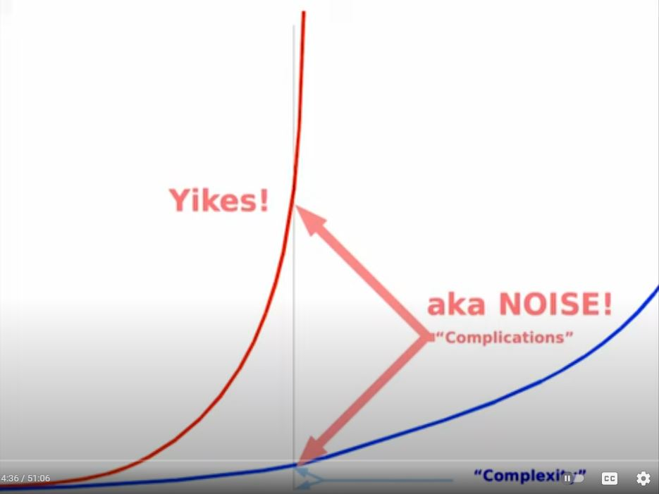

title: Accidental Complexity
author:
name: Martin Winkler
twitter: "@winkler_12"
url: https://github.com/teetotum
output: presentation.html
controls: true
progress: false
style: "./styles.css"

--

# Accidental Complexity

<div class="lower-half">
  <ul class="list-block">
    <li>Martin Winkler</li>
    <li>Web Developer</li>
    <li>Avenga Germany GmbH</li>
  </ul>
</div>

--

_Complexity_ als Last für unser Gehirn

nicht als Last für die CPU


--

- essential complexity  
  "we have a hard problem"  
  Die Komplexität der Anwendungs-Domäne

- accidental complexity  
  "we have made a problem hard"  
  Der ganze Rest

-- auto-height

Quellen

- "A Philosophy of Software Design" John Ousterhout

- "Simple Made Easy" - Rich Hickey  
  https://www.youtube.com/watch?v=SxdOUGdseq4

- Alan Kay, "Power of Simplicity"  
  https://www.youtube.com/watch?v=NdSD07U5uBs

- Kevlin Henney: Essential versus Accidental Complexity  
  https://www.youtube.com/watch?v=OFoAHSEDwe8

- "Why Can't We Make Simple Software?" - Peter van Hardenberg  
  https://www.youtube.com/watch?v=czzAVuVz7u4

--

accidental complexity

- the complexity that we create for ourselves
- choice of tooling
- choice of frameworks
- choice of languages
- package.json with 100+ dependencies
- too many layers of indirection
- spaghetti code
- opaque or cryptic naming
- lack of clarity
- noisy code
- etc.

--



Quelle: Alan Kay, "Power of Simplicity"

--
Begriffe:

Rich Hickey: _problem complexity_ vs. _incidental complexity_

Allan Kay: _essential complexity_ vs. _complications_

Fred Brooks, Kevlin Henney: _essential complexity_ vs. _accidental complexity_

Ousterhout: unnecessary complexity

--

Complexity != lines of code

A large system can still be simple.

hard to understand and modify = complicated

easy to understand and modify = simple

(Ousterhout)

--

## the dangers of complexity

- risk of project failure

> complexity getting out of hand is the biggest internal threat to software development projects
> (citation needed)

- Abhängen der anderen Entwickler

- loss of Intellectual Control (nachfolgend erklärt)

--

## Intellectual Control (term by Edsger Dijkstra)

The ability to read the code (of a module) and fully understand its flow and outcome.
In short: to reason about the code. (not Dijkstra's definition)

Quelle
https://www.georgefairbanks.com/ieee-software-v37-n3-may-2020-testing-numbs-us-to-our-loss-of-intellectual-control

--

accidental complexity in allen Ebenen:

- Platform/Runtime
- Architektur
- Programmiersprache
- Transformationen
- Bibliothenken / Dependencies
- Framework
- Projekt-Setup

--

causes of complexity: dependencies and obscurity

a dependency exists when a given piece of code cannot be understood and modified in isolation; the code relates in some way to other code, and the other code must be considered and/or modified if the given code is changed.

obscurity occurs when important information is not obvious.

(Ousterhout)

-- auto-height

wo kommt accidental complexity her?

<div class="memory-cards">
  <div class="memory-card">Bad names</div>
  <div class="memory-card">Vermischung</div>
  <div class="memory-card">kein passender Baustein</div>
  <div class="memory-card">Tradeoff</div>
  <div class="memory-card">wrong building block</div>
  <div class="memory-card">zerklitterung</div>
  <div class="memory-card">Trojanisches Pferd</div>
  <div class="memory-card">Tiefe / Breite Unverhältnis</div>
  <div class="memory-card">missed alternative</div>
  <div class="memory-card">tactical programming</div>
  <div class="memory-card">data fudging</div>
  <div class="memory-card">crowding</div>
</div>

--

- Bad names: schlecht benannte Variablen, Funktionen, Klassen

<!-- prettier-ignore -->
```ts

export const checkDates = (list: Array<DatePeriod>, current: DatePeriod): Array<DatePeriod> => { ... }
```

versus

```ts

export const omitCurrent = (list: Array<DatePeriod>, current: DatePeriod): Array<DatePeriod> => { ... }
```

--

- Vermischung: eine Code-Stelle behandelt mehrer Ideen gleichzeitig, statt separate Ideen separat zu behandeln

  Gedankenexperiment: kann ich code "einfärben"

  - eine neue Farbe für jedes separate Requirement / Idee die im Code abgebildet wird
  - ergeben sich dann klar eingefärbte Zeilen
  - oder habe ich kunterbunten Mischmasch?

--

```ts
const [randomIndices, setRandomIndices] = useState(()=>[
  ...getRandom({ cardinality: 3, range: preparedQuestions, taken: [] })
])

...

<div className={styles.preparedQuestions}>
  {preparedQuestions!.map((snippet, index) => randomIndices.includes[index] ? (
    <Button onClick={() => setQuestion(snippet)}>
      {snippet}
    </Button>
  ) : null)}
</div>
{(preparedQuestions?.length as number) > randomIndices.length && (
  <Button onClick={() => setRandomIndices((indices) => [
    ...indices, ...getRandom({ cardinality: 3, range: preparedQuestions, taken: indices })
  ])}>
    Weitere Fragen
  </Button>
)}
```

--

```ts
const [maxPreparedQuestions, setMaxPreparedQuestions] = useState<number>(3)
const [shuffledQuestions] = useState(() => shuffle(preparedQuestions ?? []))

...

<div className={styles.preparedQuestions}>
  {shuffledQuestions!.slice(0, maxPreparedQuestions).map((snippet) => (
    <Button onClick={() => setQuestion(snippet)}>
      {snippet}
    </Button>
  ))}
</div>
{(preparedQuestions?.length as number) > maxPreparedQuestions && (
  <Button onClick={() => setMaxPreparedQuestions((n) => n + 3)}>
    Weitere Fragen
  </Button>
)}
```

-- auto-height

- fehlen eines passgenauen Bausteins

```
export const ModalDialog = ({children, onOpen, onClose, ...props}) => {
  const onOpenRef = useLatestRef(onOpen)
  useEffect(() => {
      if (dialog.current) {
        const observer = new MutationObserver((mutations) => {
          const openAttrChanged = mutations
            .filter(
              (m) =>
                m.type === 'attributes' &&
                m.target === dialog.current &&
                m.attributeName === 'open',
            )
            .pop()
          if (openAttrChanged) {
            const newValue = (openAttrChanged.target as HTMLDialogElement).open
            setIsOpenInternal(newValue)
            if (newValue) onOpenRef.current?.()
          }
        })
        observer.observe(dialog.current, { attributeFilter: ['open'] })
        const syncStateClose = () => setIsOpenInternal(false)
        dialog.current.addEventListener('close', syncStateClose)
        return () => {
          dialog.current?.removeEventListener('close', syncStateClose)
          observer.disconnect()
        }
      }
    }, [])

  return (
      <dialog
        {...props}
        onClose={onClose}
      >
        {children}
      </dialog>
    )
}
```

--

```
export const ModalDialog = ({children, onOpen, onClose, ...props}) => {
  return (
      <dialog
        {...props}
        onOpen={onOpen}
        onClose={onClose}
      >
        {children}
      </dialog>
    )
}
```

--

- Tradeoff / erkaufte Eigenschaften

z.B. leichte Verwendbarkeit unseres Programms dadurch erkauft, daß wir einen Bundler verwenden  
-> gestiegene Komplexität des Projekt-Setup

--

- wrong building block

  Anekdote:
  Menü mit `<ListBox>` vs `<StackPanel>`

  - `SelectedItemChanged` als Auslöser für ein Menü-Command
  - unbeabsichtigtes Auslösen durch ArrowButtons
  - kein wiederholtes Ausführen möglich
  - kampf gegen `SelectedItem`
  - statt `<StackPanel>` mit `<Button>`

--

- zerklitterung

  Anekdote:
  Eine simple Funktion in fünf winzige Funktionen zerlegt, sodass die tatsächliche Funktionalität völlig unverständlich wurde.

--

- Das Trojanische Pferd:  
  A library decision that seemed beneficial but later regretted bitterly. Usually expensive to get rid of.


-- auto-height

- Missverhältnis von Tiefe und Breite

  Module sollen mehr Komplexität verbergen als sie durch ihre existenz Erzeugen

  Nach Ousterhout:

  modules should be deep

deep and shallow modules. the best modules are deep: they allow a lot of functionality to be accessed through a simple interface. a shallow module is one with a relatively complex interface, but not much functionality: it doesn't hide much complexity.

-- auto-height

- The missed alternative: Es gäbe eine simplere Lösung, aber dem Entwickler war diese nicht bekannt.

<!-- prettier-ignore -->
```ts
type DatePeriod = {
  start: ISO8601Date;
  end: ISO8601Date;
};

export const check = (list: Array<DatePeriod>, current: DatePeriod): Array<DatePeriod> => {
  const newList: Array<DatePeriod> = [];
  if (list) {
    list.forEach((existingPeriod) => {
      if (
        existingPeriod?.start &&
        existingPeriod?.end &&
        existingPeriod?.start !== current?.start &&
        existingPeriod?.end !== current?.end
      ) {
        newList.push({
          start: existingPeriod?.start,
          end: existingPeriod?.end,
        });
      }
    });
  }
  return newList;
};
```

versus

```ts
newList = list.filter(
  (period) => period.start !== current.start && period.end !== current.end
);
```

-- auto-height

- tactical programming

  nach Ousterhout:
  [tactical programming] is short-sighted. [...] trying to finish a task as quickly as possible [with disregard for system structure].
  this is how systems become complicated. [...] complexity is incremental.
  If you program tactically, each programming task will contribute a few of these complexities.

--

- data fudging: meddling with data motivated by a purely presentational concern

  Anekdote:

  - Der springende Cursor
    
    
    und
  - "Mehr Items" als letzter Eintrag

--

- crowding / Wall of Text

```ts
get satelliteDisabled() {
    return (
      this.widgetMeta?.satellite === false ||
      this.config._tracking?.inview === null ||
      (this.topParent !== this.root &&
        this.config._tracking?.inview === undefined &&
        BaseState.NESTED_WIDGETS.includes(this.topParent.dataset.fsw!))
    )
  }
```

-- auto-height

accidental complexity

- Passiert ganz von selbst wenn nicht aktiv gegengesteuert wird.
  Quasi "Naturgesetz" der Software-Entwicklung.
- Hat nichts mit Dummheit zu tun
- Passiert auch den Besten
- Gegensteuern lohnt sich langfristig

--

## Kommen wir jemals auf 0?

Nein, nur theoretisches Ideal - wie der absolute Nullpunkt der Physik.
Außerdem: Tradeoffs, und unverschuldete Komplexität existieren

--

Aber wenn man nun mal in seinem Projekt tief in der roten Zone ist?

Was tun?

- Refactoring ist schön und gut aber oft nicht machbar:
  - Budget
  - Zeit
  - kein geeigneter "Anpack"
  - noch zuwenig Durchblick

Es muss nicht immer gleich ein Refactoring sein!

-- auto-height

Wertvollste Information im Code ist: Intention

- re-introducing _intention_ into the code where it's missing
- low effort - high impact

Vorgehen:

- beim täglichen arbeiten
- in dem Modul in dem man sowieso gerade tätig werden muss
- sobald man einen Baustein verstanden hat
- die Intention im Code ergänzen
  - bessere Namen wählen
  - Kommentare als "Brotkrumen" und Hinweise hinterlassen

--

<h1>
Genug für heute.
</h1>
