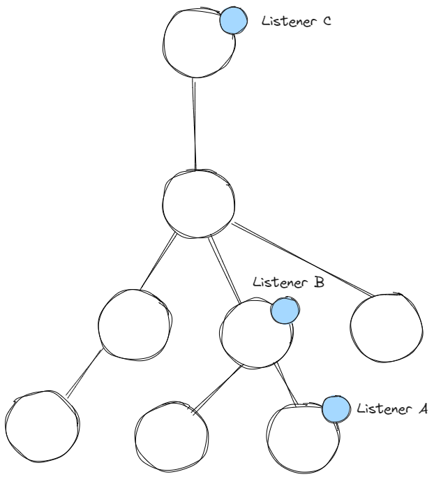
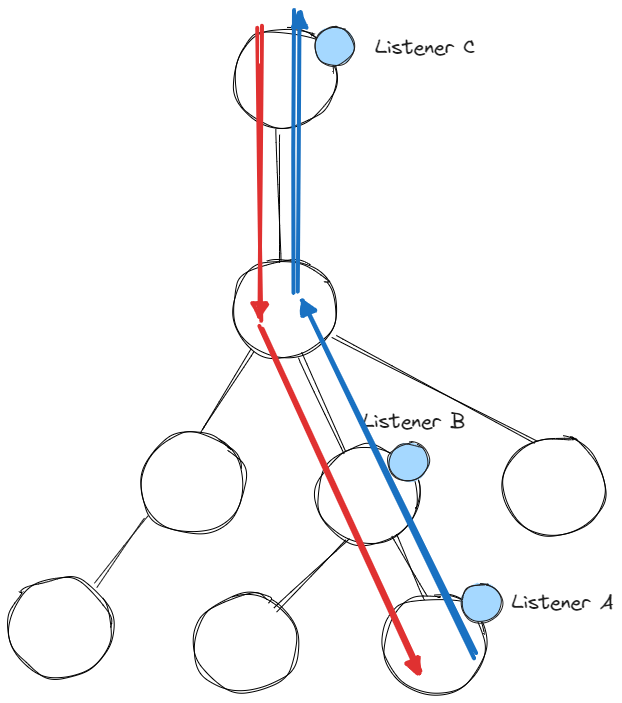
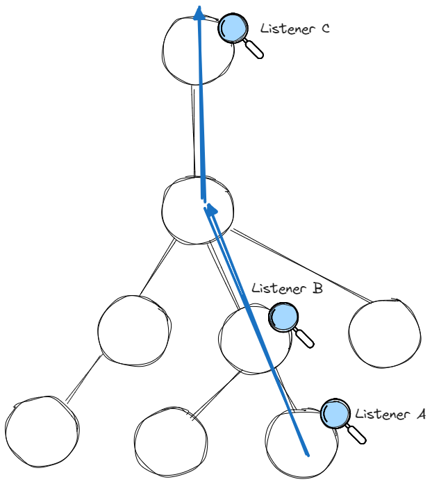

title: DOM Event Cancellation - pitfalls and solutions
author:
name: Martin Winkler
twitter: "@winkler_12"
url: https://github.com/teetotum
output: dom_event_cancellation_revised_presentation.html
controls: true
progress: false
style: "./presentation.css"

--
Martin Winkler<br>
twitter: `@winkler_12`<br>
mastodon: `@mwinkler`<br>
blog: `https://dev.to/teetotum`<br>
github: `https://github.com/teetotum`<br>

-- centered-text

# DOM Event Cancellation

pitfalls and solutions

--

Apology.

Should've called it _DOM Event Handledness_

-- centered-text fit-image



-- centered-text

When would I need that?

[Example app](file:///C:/tinkerspace/material/dom-event-cancellation-revised/piggybank.html)

--

## Event Cancellation (or Handledness)

I found no official guidance.

MDN calls `e.preventDefault()` _cancelling_ an event.

--

Fictitious example: Online Banking App

- any click or key down event resets session timeout
- column headers can be selected
- account transactions table can be sorted
- any dropdowns and popups close when clicks occur outside
- any dropdowns and popups can be closed with 'Esc'
- nested dropdowns and popups close before outer ones

--

- any click or key down event resets session timeout

```js
const resetSessionTimeout = () => {
  secondsTillLockout = sessionTimeoutSeconds;
  updateTimeoutUI();
};
document.documentElement.addEventListener("click", resetSessionTimeout);
document.documentElement.addEventListener("keydown", resetSessionTimeout);
```

should always run - for any click or keydown

--

- column headers can be selected
- account transactions table can be sorted

```js
colHeader.addEventListener("click", (e) => {
  colHeader.classList.toggle("selected");
});

colHeader.querySelector(".sort-asc").addEventListener("click", (e) => {
  rows.sort((a, b) => comparer(a, b));
  tBody.append(...rows);
});
```

needs a condition - only one of the two should ever run

--

- any dropdowns and popups close when clicks occur outside

```js
const mightClose = (e) => {
  if (!popup.contains(e.target)) close();
};
document.documentElement.addEventListener("click", mightClose);
```

should always run - for any click

--

- any dropdowns and popups can be closed with 'Esc'
- nested dropdowns and popups close before outer ones

```js
// popup code
const handleEscape = (e) => {
  if (e.key === "Escape" && isOpen) {
    close(e);
  }
};
popup.addEventListener("keydown", handleEscape);
```

```js
// dropdown code
const handleEscape = (e) => {
  if (e.key === "Escape" && isOpen) {
    close(e);
  }
};
dropdown.addEventListener("keydown", handleEscape);
```

needs a condition - only one of the two should ever run

--

## Observation

Two categories of event`*` listeners:

- Those whose effect depends on the event being unhandled
- And those whose effect fires unconditionally

I postulate: All event`*` listeners fall into one of the two categories.

<hr />

`*` Only regarding browser generated events. Custom events could exhibit a completely different nature, I don't have enough data to form an opinion yet.

--

First Category:

- usually the effect directly intended by the user
- mental model: one user action => one direct effect
- therefore a dual effect would be confusing

=> _Primary Effect_

- Browser default actions always count as Primary Effects

--

Second Category:

- usually some form of bookkeeping / housekeeping
- side effects of user interaction
- the user might be unaware of the effect
- any number of unrelated bookkeeping tasks possible
- we don't want to omit any one of them

=> _Secondary Effect_

--

Cancellation must ensure that:

- at most one Primary Effect runs
- all Secondary Effects run

--

## Two different approaches

-- fit-image

First Approach: First listener decides for all later listeners

```js
const handleEscape = (e) => {
  if (e.key === "Escape" && isOpen) {
    close(e);
    e.stopPropagation();
  }
};
```

Pitfalls:

- this would also prevent Secondary Effects.
- `stopPropagation()` does not prevent browser default actions, so we would still need to call `preventDefault()` in addition for events that could trigger a browser default action.

-- fit-image


--

<div class="sequence" >
<div class="item primary">close dropdown</div>
<div class="cancelling"></div>
<div class="item primary">close dialog</div>
<div class="item secondary" onclick="this.classList.add('move-to-first')">refresh session</div>
</div>

-- fit-image

Two event phases: Capturing and Bubbling



-- fit-image

Switch all Secondary Effects over to the Capturing phase


--

Conclusion for first approach

- actually works
- MUST have all Primary Effects in the Bubbling phase
- MUST have all Secondary Effects in the Capturing phase
- Primary Effects must call `stopPropagation` (and `preventDefault`)
- Secondary Effects must never call `stopPropagation`

-- fit-image

Second Approach: Each listern decides for itself



--

_Primary Effect_ event listeners must inspect a flag on the event arguments object, decide what to do, and set the flag if they handled the event.

A natural candidate for such a flag is `defaultPrevented`

--

```js
const handleEscape = (e) => {
  if (e.key === "Escape" && isOpen && !e.defaultPrevented) {
    close(e);
    e.preventDefault();
  }
};
```

--

Conclusion for second approach

- actually works
- keeps both event phases available for implementors to tweak listener order for any reason
- Primary Effects MUST inspect `defaultPrevented`
- Primary Effects MUST call `preventDefault` if handling the event
- Secondary Effects must never call `preventDefault`

--

Pro & Con

- First approach is probably used more frequently and might be used by the UI library you rely on
- Second approach affords us greater flexibility
- Second approach doesn't need special handling for brower default actions

--

What about `cancelable`?

All standard DOM events are cancelable.
But this can be used with custom events to allow communication whether an intended action should proceed:

```js
if (
  this.dispatchEvent(
    new Event("try_close", { cancelable: true, bubbles: true })
  )
) {
  this.close();
  this.dispatchEvent(new Event("closed", { bubbles: true }));
} else {
  this.dispatchEvent(new Event("close_cancelled", { bubbles: true }));
}
```

The condition would be `false` if any listener would have called `e.preventDefault`.

Whether this rules out the second approach I cannot tell.

--

What about `passive`?

Listeners can be declared `passive` to signal to the browser that they don't call `preventDefault` so the browser could run the default action before event propagation.
For example: to ensure smooth scolling behavior it is recommended to mark all `scroll` listeners as `passive`.

For the second approach this would mean that all Secondary Effects could safely be marked `passive`, but that none of the Primary Effects could ever be marked `passive`.

--

What about `shadow DOM`?

We should be able to receive UA generated events originating in the shadown DOM.

It seems some interactive elements using a shadow DOM currently swallow events, like `<input type="date">`, we get neither the Capturing nor the Bubbling phase.

"Date Picker popup doesn't propagate shadow DOM events into the light DOM"

https://github.com/whatwg/html/issues/10343

Custom web component authors have the option to make DOM events from the shadow DOM visible to listeners in the regular DOM via `composed` + `bubbles`.

--

revisit the banking app?
